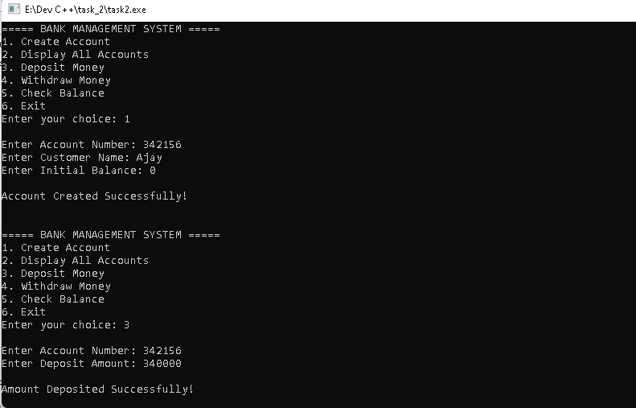
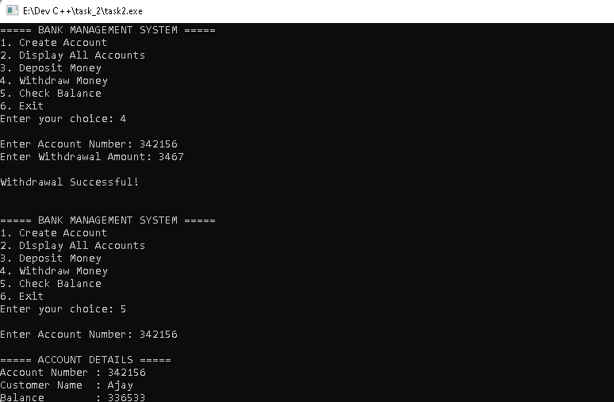
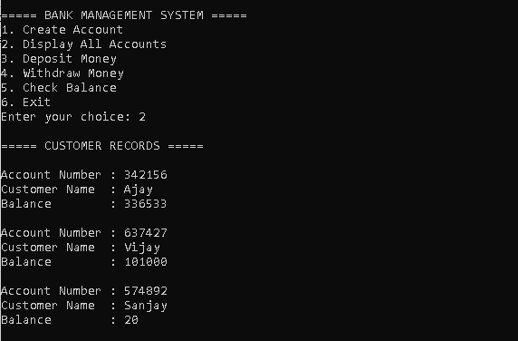
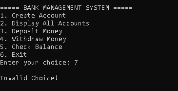

# Bank Management System in C++

## Overview
This project is a console-based Bank Management Application developed using C++.  
It simulates core banking operations using object-oriented programming and file handling.

The system allows users to:
- Create bank accounts
- Deposit money
- Withdraw money
- Check account balance
- Store customer records permanently using files

---

## Features
- Account Creation
- Deposit Money
- Withdraw Money
- Balance Inquiry
- Display Customer Records
- Persistent File Storage
- Menu-Driven Console Interface

---

## Technologies Used
- C++
- Object-Oriented Programming (OOP)
- File Handling

---

## How to Run

### Compile
```bash
g++ main.cpp -o bank
```

### Run
```bash
./bank
```

---

## Sample Menu

```text
===== BANK MANAGEMENT SYSTEM =====
1. Create Account
2. Display All Accounts
3. Deposit Money
4. Withdraw Money
5. Check Balance
6. Exit
```

---

## Concepts Used
- Classes and Objects
- Functions
- File Handling
- Conditional Statements
- Loops
- Menu-Driven Programming

---

## Data Storage
Customer records are stored in:

```text
bank.txt
```

---

# Output Screenshots

## Create Account



---

## Deposit Money



---

## Withdraw Money



---

## Balance Inquiry



## Expected Outcome
A secure and functional banking system capable of performing deposits, withdrawals, and balance inquiries while maintaining persistent customer records.
